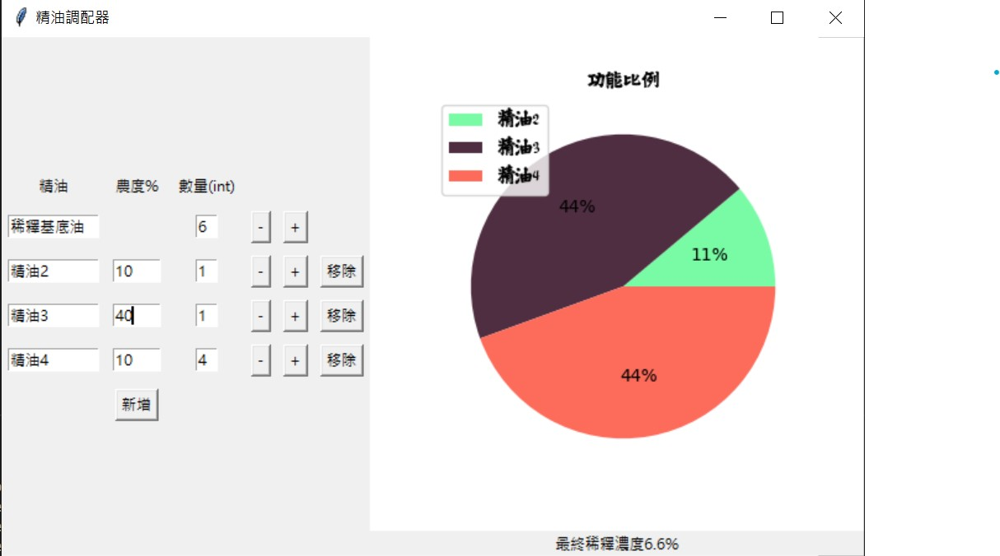

這是精油調配器的起點
# windows
# 環境安裝
py -m venv pyenv
pip install -U pip
pip install -r requirements.txt
# 打包
pyinstaller ./oil_app.spec

# 畫面

圖例為:

    品項              稀釋物質      |   純油

 稀釋基底油 = 6 (滴) * 100/100      |   0
 
 精油2      = 1 (滴) * 10/110       |  1(滴) * 100/110
 
 精油3      = 1 (滴) * 40/140       |  1(滴) * 100/140
 
 精油4      = 4 (滴) * 10/110       |  4(滴) * 100/110

-----

 功能比例 = 純油(總純油)

 最終稀釋濃度 = 總純油/總稀釋物質 